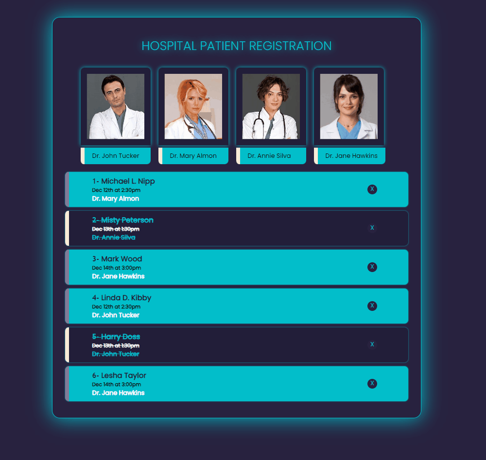

# Hospital Patient Registration React App - Project Overview

<h3>Visit: https://hospital-patient-registration-react.netlify.app/</h3>

## Description:
In this project, a Hospital Patient Registration application is developed using React. The app allows users to register patients for appointments with different doctors. The project utilizes `useState` hook to manage the state of the app and includes the following components:

## Components:

### Home Component
- The Home component serves as the main entry point of the application.
- It contains state hooks to manage doctor and patient data, as well as the news state for filtered patients.
- Users can view different doctors and their images by clicking on the doctor's name or image.
- Clicking on a doctor's name or image filters the patient list based on the selected doctor.
- The patient list is rendered using the `HastaListe` component, which displays patient information and allows users to mark patients as completed or remove them from the list.
- The Home component also includes the `HastaEkle` component, allowing users to add new patients by providing their name and appointment date.

### HastaListe Component
- The HastaListe component displays the list of patients and their appointment details.
- The component maps through the patient data and renders each patient as a list item.
- Each patient item has a toggleable 'completed' style, determined by the 'bittiMi' property in the patient data.
- Users can double-click on a patient to mark them as completed (or undo completion).

### HastaEkle Component
- The HastaEkle component enables users to add new patients to the list.
- It includes form fields for entering the patient's name and appointment date.
- When the form is submitted, the new patient is added to the patient list, including relevant details like doctor's name and completion status.

## Styling
- The application's styling is done using CSS.
- The page has a dark background with contrasting colors for doctor and patient information.
- Different styles are applied to patients based on their completion status.

## Summary
The Hospital Patient Registration application built with React demonstrates the use of `useState` hook for state management and the creation of functional components to manage patient data. It allows users to view different doctors and their patient lists, add new patients with appointment details, and mark patients as completed or undo completion. The project can serve as a starting point for more advanced hospital management applications, with the potential to add more features such as patient filtering, sorting, and data persistence.
